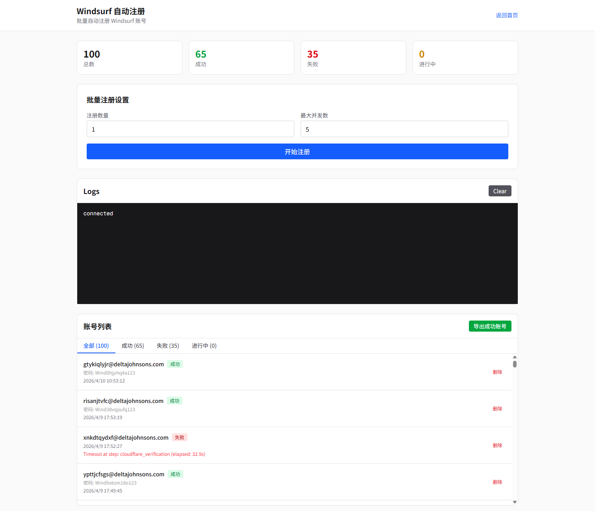
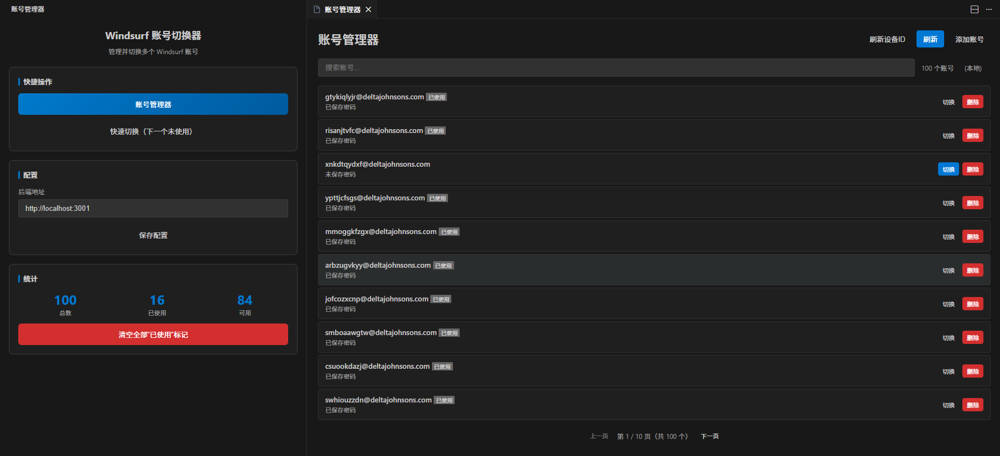

<div align="center">

# Windsurf Auto Free

**Windsurf IDE Account Management Toolkit**

Automatically register and manage Windsurf accounts with ease

[](https://nextjs.org/)
[](https://react.dev/)
[](https://fastify.dev/)
[](https://python.org/)
[](LICENSE)

</div>

---

## Overview

Windsurf Auto Free is an automated toolkit for managing Windsurf IDE accounts. It provides a complete solution for batch registration, account management, and seamless account switching directly within your IDE.

## Key Features

- **Batch Registration** - Automatically register multiple Windsurf accounts with configurable concurrency
- **Real-time Monitoring** - Live logs and progress tracking via Server-Sent Events (SSE)
- **Account Pool Management** - Store, filter, and export registered accounts
- **IDE Extension** - Switch accounts directly in Windsurf/VSCode without manual configuration
- **Cloudflare Bypass** - Uses DrissionPage (Windows API) to bypass Cloudflare detection

## Screenshots

<!--
  Placeholder for screenshots
  Recommended sizes: 1200x800 or 1920x1080
-->

| Registration Dashboard | IDE Extension |
|:---:|:---:|
|  |  |
| *Real-time registration progress and logs* | *Switch accounts directly in Windsurf* |

## Project Structure

```
windsurf-auto-free/
apps/
  extension/           # VSCode/Windsurf extension
    src/
      extension.ts     # Extension entry point
    package.json       # Extension manifest
  server/              # Backend API service
    src/
      routes/          # API endpoints
      services/        # Business logic
      lib/             # Utilities
    prisma/
      schema.prisma    # Database schema
    windsurf_register.py  # Python automation script
  web/                 # Web UI (Next.js)
    src/app/
      page.tsx         # Registration page
packages/
  shared/              # Shared types and schemas
```

## Tech Stack

| Category | Technologies |
|----------|-------------|
| **Frontend** | Next.js 16, React 19, Tailwind CSS, shadcn/ui |
| **Backend** | Fastify 5, Prisma, SQLite |
| **Automation** | Python 3.11, DrissionPage |
| **Extension** | VSCode Extension API |

## Prerequisites

- **Node.js** >= 18.0.0
- **pnpm** >= 8.0.0
- **Python** >= 3.11
- **Chrome/Chromium** browser installed
- **Windows** (required for DrissionPage automation)

## Installation

### 1. Clone the repository

```bash
git clone https://github.com/your-username/windsurf-auto-free.git
cd windsurf-auto-free
```

### 2. Install Node.js dependencies

```bash
pnpm install
```

### 3. Install Python dependencies

```bash
pip install DrissionPage requests
```

### 4. Initialize the database

```bash
cd apps/server
pnpm db:generate
pnpm db:push
```

## Usage

### Start Backend Server

```bash
cd apps/server
pnpm dev
```

The API server will start at `http://localhost:3001`
SSE server will start at `http://localhost:3002`

### Start Web UI

```bash
cd apps/web
pnpm dev
```

The web interface will be available at `http://localhost:3000`

### Start Both Services

```bash
# From project root
pnpm dev
```

## Feature Guide

### 1. Windsurf Auto Registration

Access the registration page at `http://localhost:3000/`

**Configuration:**
- **Count**: Number of accounts to register (1-100)
- **Concurrency**: Parallel registration processes (1-5)

**Registration Flow:**
1. Creates temporary email via Mail.tm
2. Opens Windsurf registration page
3. Fills registration form
4. Handles Cloudflare verification
5. Retrieves verification code from email
6. Extracts Firebase token for API key
7. Stores account in database

**Note:** Headless mode is disabled because Cloudflare blocks headless browsers. The browser window will appear minimized in the corner.

### 2. Account Management

**API Endpoints:**

| Method | Endpoint | Description |
|--------|----------|-------------|
| POST | `/api/windsurf/register` | Start batch registration |
| POST | `/api/windsurf/stop` | Stop registration |
| GET | `/api/windsurf/status` | Get registration status |
| GET | `/api/windsurf/accounts` | List all accounts |
| DELETE | `/api/windsurf/accounts/:id` | Delete account |

**Account Status:**
- `pending` - Waiting to register
- `registering` - Currently in progress
- `success` - Successfully registered
- `failed` - Registration failed

### 3. IDE Extension

Build and install the extension:

```bash
cd apps/extension
pnpm build:en    # Build English version
# or
pnpm build:zh    # Build Chinese version

# Package as VSIX
pnpm package:en  # Creates ide-toolkit-en.vsix
```

Install in Windsurf/VSCode:
1. Open Extensions panel
2. Click "..." menu
3. Select "Install from VSIX..."
4. Choose the generated `.vsix` file

## Configuration

### Environment Variables

Create `.env` file in `apps/server/`:

```env
DATABASE_URL="file:./dev.db"
```

### Backend URL (Extension)

Configure in VSCode settings:
```json
{
  "ideToolkit.backendUrl": "http://localhost:3001"
}
```

## API Documentation

Access Swagger UI at `http://localhost:3001/docs`

## Troubleshooting

| Issue | Solution |
|-------|----------|
| Cloudflare blocks registration | Ensure browser window is visible (not headless) |
| Chrome not found | Install Chrome/Chromium browser |
| Python script fails | Check DrissionPage installation: `pip show DrissionPage` |
| Database errors | Run `pnpm db:push` to sync schema |
| SSE connection fails | Verify port 3002 is available |

## Known Limitations

- **Windows Only**: DrissionPage uses Windows API for browser automation
- **No Headless Mode**: Cloudflare detects and blocks headless browsers
- **Chrome Required**: Automation requires Chrome/Chromium browser

## Contributing

Contributions are welcome! Please feel free to submit a Pull Request.

## License

This project is licensed under the MIT License - see the [LICENSE](LICENSE) file for details.

---

<div align="center">

**[Back to Top](#windsurf-auto-free)**

Made with by the community

</div>